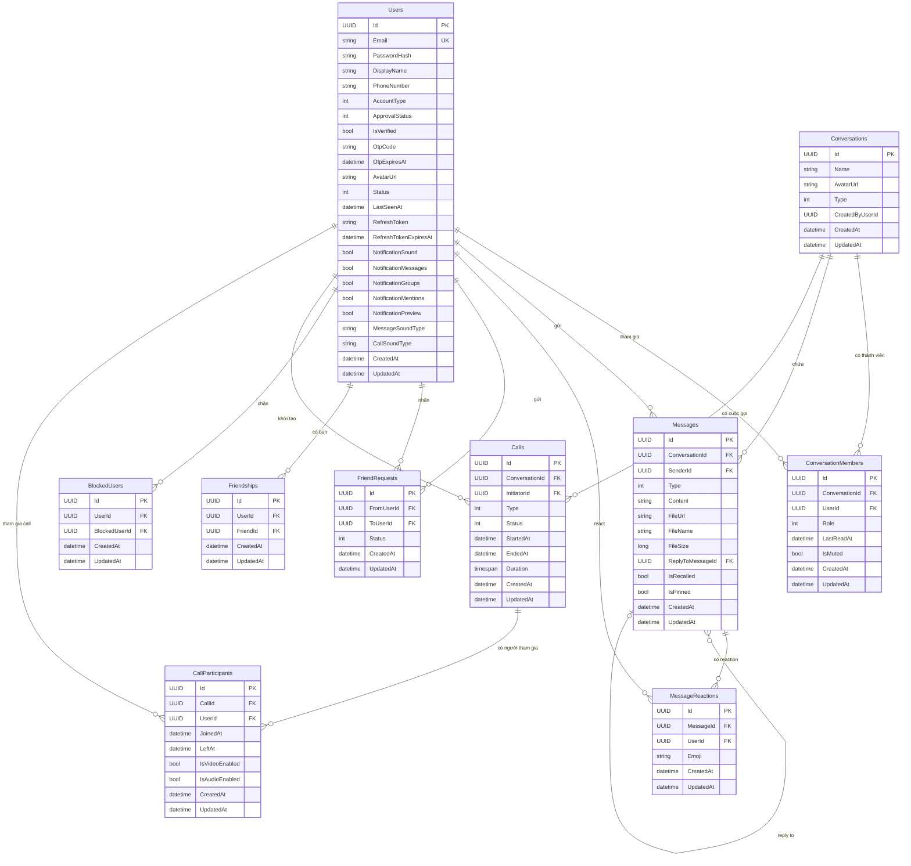

# ERD — AmiChat Backend Database Schema

## Tổng quan

Hệ thống gồm **11 bảng** được tổ chức theo các nhóm chức năng:
- **Người dùng**: `Users`
- **Bạn bè**: `FriendRequests`, `Friendships`, `BlockedUsers`
- **Hội thoại**: `Conversations`, `ConversationMembers`
- **Tin nhắn**: `Messages`, `MessageReactions`
- **Cuộc gọi**: `Calls`, `CallParticipants`

Tất cả bảng kế thừa 3 cột chung từ `BaseEntity`: `Id (UUID)`, `CreatedAt`, `UpdatedAt`.

---

## Mô tả từng bảng

### Users
| Cột | Kiểu | Mô tả |
|-----|------|-------|
| Id | UUID (PK) | |
| Email | string | Unique |
| PasswordHash | string | Bcrypt hash |
| DisplayName | string | Tên hiển thị |
| PhoneNumber | string? | Số điện thoại (thêm Phase 0) |
| AvatarUrl | string? | URL ảnh đại diện |
| AccountType | int | 0=Customer, 1=Employee, 2=Admin (thêm Phase 0) |
| ApprovalStatus | int | 0=Pending, 1=Approved, 2=Rejected (thêm Phase 0) |
| IsVerified | bool | Đã xác thực OTP email (thêm Phase 0) |
| OtpCode | string? | Mã OTP tạm thời (thêm Phase 0) |
| OtpExpiresAt | datetime? | Hết hạn OTP (thêm Phase 0) |
| Status | int | 0=Offline, 1=Online, 2=Away, 3=InMeeting, 4=WorkFromHome |
| LastSeenAt | datetime? | Lần cuối online |
| RefreshToken | string? | JWT refresh token |
| RefreshTokenExpiresAt | datetime? | Hết hạn refresh token |
| NotificationSound | bool | Bật/tắt âm thanh thông báo |
| NotificationMessages | bool | Thông báo tin nhắn |
| NotificationGroups | bool | Thông báo nhóm |
| NotificationMentions | bool | Thông báo mention |
| NotificationPreview | bool | Hiển thị preview thông báo |
| MessageSoundType | string | Loại âm thanh tin nhắn (default: "ding") |
| CallSoundType | string | Loại âm thanh cuộc gọi (default: "chime") |
| CreatedAt | datetime | |
| UpdatedAt | datetime? | |

---

### Conversations
| Cột | Kiểu | Mô tả |
|-----|------|-------|
| Id | UUID (PK) | |
| Name | string? | Tên nhóm (null nếu là Direct) |
| AvatarUrl | string? | Avatar nhóm |
| Type | int | 0=Direct, 1=Group |
| CreatedByUserId | UUID? | Người tạo nhóm |
| CreatedAt | datetime | |
| UpdatedAt | datetime? | |

---

### ConversationMembers
| Cột | Kiểu | Mô tả |
|-----|------|-------|
| Id | UUID (PK) | |
| ConversationId | UUID (FK → Conversations) | |
| UserId | UUID (FK → Users) | |
| Role | int | 0=Member, 1=Admin |
| LastReadAt | datetime? | Thời điểm đọc cuối |
| IsMuted | bool | Tắt thông báo cho conversation này |
| CreatedAt | datetime | |
| UpdatedAt | datetime? | |

---

### Messages
| Cột | Kiểu | Mô tả |
|-----|------|-------|
| Id | UUID (PK) | |
| ConversationId | UUID (FK → Conversations) | |
| SenderId | UUID? (FK → Users) | Null nếu là tin nhắn hệ thống |
| Type | int | 0=Text, 1=Image, 2=File, 3=Poll, 4=Sticker, 5=System |
| Content | string? | Nội dung text (null khi đã thu hồi) |
| FileUrl | string? | URL file/ảnh |
| FileName | string? | Tên file gốc |
| FileSize | long? | Kích thước file (bytes) |
| ReplyToMessageId | UUID? (FK → Messages) | Tin nhắn được reply |
| IsRecalled | bool | Đã thu hồi |
| IsPinned | bool | Đã ghim |
| CreatedAt | datetime | |
| UpdatedAt | datetime? | |

---

### MessageReactions
| Cột | Kiểu | Mô tả |
|-----|------|-------|
| Id | UUID (PK) | |
| MessageId | UUID (FK → Messages) | |
| UserId | UUID (FK → Users) | |
| Emoji | string | Emoji reaction |
| CreatedAt | datetime | |
| UpdatedAt | datetime? | |

> Unique constraint: (MessageId, UserId, Emoji)

---

### FriendRequests
| Cột | Kiểu | Mô tả |
|-----|------|-------|
| Id | UUID (PK) | |
| FromUserId | UUID (FK → Users) | Người gửi |
| ToUserId | UUID (FK → Users) | Người nhận |
| Status | int | 0=Pending, 1=Accepted, 2=Rejected |
| CreatedAt | datetime | |
| UpdatedAt | datetime? | |

---

### Friendships
| Cột | Kiểu | Mô tả |
|-----|------|-------|
| Id | UUID (PK) | |
| UserId | UUID (FK → Users) | |
| FriendId | UUID (FK → Users) | |
| CreatedAt | datetime | |
| UpdatedAt | datetime? | |

> Khi A kết bạn với B, tạo 2 bản ghi: (A→B) và (B→A)

---

### BlockedUsers
| Cột | Kiểu | Mô tả |
|-----|------|-------|
| Id | UUID (PK) | |
| UserId | UUID (FK → Users) | Người chặn |
| BlockedUserId | UUID (FK → Users) | Người bị chặn |
| CreatedAt | datetime | |
| UpdatedAt | datetime? | |

---

### Calls
| Cột | Kiểu | Mô tả |
|-----|------|-------|
| Id | UUID (PK) | |
| ConversationId | UUID (FK → Conversations) | |
| InitiatorId | UUID (FK → Users) | Người bắt đầu cuộc gọi |
| Type | int | 0=Audio, 1=Video |
| Status | int | 0=Initiated, 1=Ringing, 2=Active, 3=Ended, 4=Missed, 5=Rejected |
| StartedAt | datetime? | Thời điểm bắt đầu (khi Active) |
| EndedAt | datetime? | Thời điểm kết thúc |
| Duration | timespan? | Thời lượng cuộc gọi |
| CreatedAt | datetime | |
| UpdatedAt | datetime? | |

---

### CallParticipants
| Cột | Kiểu | Mô tả |
|-----|------|-------|
| Id | UUID (PK) | |
| CallId | UUID (FK → Calls) | |
| UserId | UUID (FK → Users) | |
| JoinedAt | datetime? | Thời điểm tham gia |
| LeftAt | datetime? | Thời điểm rời |
| IsVideoEnabled | bool | Camera bật/tắt |
| IsAudioEnabled | bool | Mic bật/tắt |
| CreatedAt | datetime | |
| UpdatedAt | datetime? | |

---

## ERD Diagram (Mermaid)

---

## Quan hệ tóm tắt

| Quan hệ | Loại | Ghi chú |
|---------|------|---------|
| Users ↔ Conversations | N-N | Qua ConversationMembers |
| Conversations → Messages | 1-N | |
| Users → Messages | 1-N | SenderId nullable (system messages) |
| Messages → Messages | self FK | ReplyToMessageId |
| Messages ↔ Users | N-N | Qua MessageReactions |
| Users ↔ Users (bạn bè) | N-N | Qua Friendships (2 bản ghi / cặp) |
| Users → Users (lời mời) | N-N | Qua FriendRequests |
| Users → Users (chặn) | N-N | Qua BlockedUsers |
| Conversations → Calls | 1-N | |
| Calls ↔ Users | N-N | Qua CallParticipants |

---

## Enum Values

### OnlineStatus
| Value | Tên |
|-------|-----|
| 0 | Offline |
| 1 | Online |
| 2 | Away |
| 3 | InMeeting |
| 4 | WorkFromHome |

### ConversationType
| Value | Tên |
|-------|-----|
| 0 | Direct |
| 1 | Group |

### MessageType
| Value | Tên |
|-------|-----|
| 0 | Text |
| 1 | Image |
| 2 | File |
| 3 | Poll |
| 4 | Sticker |
| 5 | System |

### MemberRole
| Value | Tên |
|-------|-----|
| 0 | Member |
| 1 | Admin |

### FriendRequestStatus
| Value | Tên |
|-------|-----|
| 0 | Pending |
| 1 | Accepted |
| 2 | Rejected |

### CallType
| Value | Tên |
|-------|-----|
| 0 | Audio |
| 1 | Video |

### CallStatus
| Value | Tên |
|-------|-----|
| 0 | Initiated |
| 1 | Ringing |
| 2 | Active |
| 3 | Ended |
| 4 | Missed |
| 5 | Rejected |
